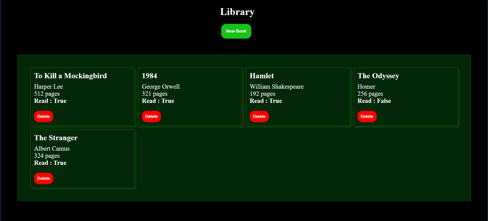

# Library

A simple web application to manage your personal library. Add, view, update, and delete books using a clean and interactive interface.

## Features

- Add new books with title, author, page count, and read status
- View all books in a responsive grid layout
- Toggle the read status of each book
- Delete books from your library
- Modal dialog for adding books with form validation

## Usage

1. Open `index.html` in your browser.
2. Click **New Book** to add a book.
3. Fill in the form and submit to add the book to your library.
4. Click on the "Read" status to toggle it.
5. Click **Delete** to remove a book.

## Project Structure

- [`index.html`](Library/index.html): Main HTML file
- [`styles.css`](Library/styles.css): Styles for the app
- [`script.js`](Library/script.js): JavaScript logic for managing the library

## Screenshots

 <!-- Add a screenshot in the images folder if available -->

## Credits

Created by Ghulam Mustafa Bhatti.

## License

This project is for educational purposes.
